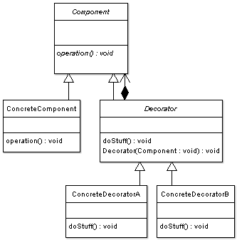

# Controller Decorator

The ColdBox controller object is bound to the framework release and as we all know, each application is different in requirements and architecture. Thus, we have the application of the [Decorator Pattern ](https://sourcemaking.com/design_patterns/decorator)to our ColdBox Controller object in order to help developers program to their needs. So what does this mean? Plain and simply, you can decorate the ColdBox Controller object with one of your own. You can extend the functionality to the specifics of the software you are building. You are not modifying the framework code base, but extending it and building on top of what ColdBox offers you.

> "A decorator pattern allows new/additional behavior to be added to an existing method of an object dynamically." Wikipedia



## For what can I use this?

* You can override the original framework methods to meet your needs.
* These new functionalities can be specific to your application and architectural needs.
* Have different Controllers for different protocols.
* Much more.

## How does it work

Create a component that extends `coldbox.system.web.ControllerDecorator`, this is to provide all the functionality of an original ColdBox Controller as per the design pattern. Once you have done this, you will create a `configure()` method that you can use for custom configuration when the Controller gets created by the framework on application start. Then it’s up to you to add your own methods or override the original methods. \([See API](https://apidocs.ortussolutions.com/coldbox/current)\). 


In order to access the original controller object you will use the provided method called: `getController().`


### **Declaration**

Here is the Controller Decorator code:


```javascript
component extends="coldbox.system.web.ControllerDecorator"{

    function configure(){

    }

    function setNextEvent(){
        // Add SSL eq true to ALL relocations
        arguments.ssl = true;
        // Send the relocation back to the existing controller
        getController().setNextEvent( argumentCollection=arguments );
    }

}
```


### Configuration

The last step in this guide is to show you how to declare your decorator in your ColdBox configuration file. Look at the sample snippet below:


```javascript
coldbox.controllerDecorator = "models.MyControllerDecorator";
```


The value of the setting is the instantiation path of your Controller decorator CFC.

### Conclusion

As you can see from this guide, constructing ColdBox Controller Decorators are very easy. You have a pre-defined structure that you need to implement and an easy setting to configure. You now have a great way to expand on your application requirements and add additional functionality without modifying the framework. Just remember: With great power, comes great responsibility. The possibilities are endless with this feature. Enjoy!

