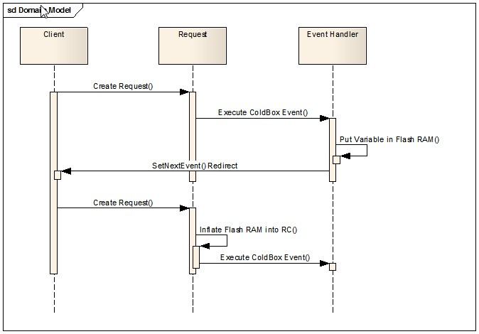

# Flash RAM

The purpose of the Flash RAM is to allow variables to be persisted seamlessly from one request and be picked up in a subsequent request\(s\) by the same user. This allows you to hide implementation variables and create web flows or conversations in your ColdBox applications. So why not just use session or client variables? Well, most developers forget to clean them up and sometimes they just end up overtaking huge amounts of RAM and no clean cut definition is found for them. With Flash RAM, you have the facility already provided to you in an abstract and encapsulated format. This way, if you need to change your flows storage scope from session to client scope, the change is seamless and painless.

Every handler, plugin, interceptor, layout and view has a flash object in their variables scope already configured for usage. The entire flash RAM capabilities are encapsulated in a flash object that you can use in your entire ColdBox code. Not only that, but the ColdBox Flash object is based on an interface and you can build your own Flash RAM implementations very easily. It is extremely flexible to work on a concept of a Flash RAM object than on a storage scope directly. So future changes are easily done at the configuration level.

Our Flash Scope also can help you maintain flows or conversations between requests by using the `discard()` and `keep()` methods. This will continue to expand in our 3.X releases as we build our own conversations DSL to define programmatically wizard like or complex web conversations. Also, the ColdBox Flash RAM has the capability to not only maintain this persistence scope but it also allows you to seamlessly re-inflate these variables into the request collection or private request collection, both or none at all.

