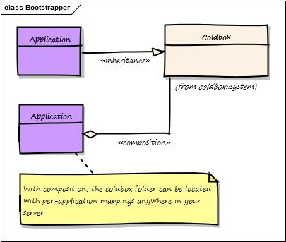

# Bootstrapper - Application.cfc

The `Application.cfc` is one of the most important files in your application as it is where you define all the implicit ColdFusion engine events, session, client scopes, ORM, etc. It is also how you tell ColdFusion to bootstrap the ColdBox Platform for your application. There are two ways to bootstrap your application:

1. Leverage composition and bootstrap ColdBox \(**Default**\)
2. Leverage inheritance and bootstrap ColdBox




The composition approach allows you to have a more flexible configuration as it will allow you to use per-application mappings for the location of the ColdBox Platform.



**Tip:** To see the difference, just open the appropriate `Application.cfc` in the application templates.


## Composition



```javascript
component{
    // Application properties
    this.name = hash( getCurrentTemplatePath() );
    this.sessionManagement = true;
    this.sessionTimeout = createTimeSpan(0,0,30,0);
    this.setClientCookies = true;

    // COLDBOX STATIC PROPERTY, DO NOT CHANGE UNLESS THIS IS NOT THE ROOT OF YOUR COLDBOX APP
    COLDBOX_APP_ROOT_PATH = getDirectoryFromPath( getCurrentTemplatePath() );
    // The web server mapping to this application. Used for remote purposes or static purposes
    COLDBOX_APP_MAPPING   = "";
    // COLDBOX PROPERTIES
    COLDBOX_CONFIG_FILE      = "";
    // COLDBOX APPLICATION KEY OVERRIDE
    COLDBOX_APP_KEY          = "";

    // application start
    public boolean function onApplicationStart(){
        application.cbBootstrap = new coldbox.system.Bootstrap( COLDBOX_CONFIG_FILE, COLDBOX_APP_ROOT_PATH, COLDBOX_APP_KEY, COLDBOX_APP_MAPPING );
        application.cbBootstrap.loadColdbox();
        return true;
    }

    // request start
    public boolean function onRequestStart(String targetPage){
        // Process ColdBox Request
        application.cbBootstrap.onRequestStart( arguments.targetPage );

        return true;
    }

    public void function onSessionStart(){
        application.cbBootStrap.onSessionStart();
    }

    public void function onSessionEnd( struct sessionScope, struct appScope ){
        arguments.appScope.cbBootStrap.onSessionEnd( argumentCollection=arguments );
    }

    public boolean function onMissingTemplate( template ){
        return application.cbBootstrap.onMissingTemplate( argumentCollection=arguments );
    }

}
```



## Inheritance



```javascript
component extends="coldbox.system.Bootstrap"{

    // Application properties
    this.name = hash( getCurrentTemplatePath() );
    this.sessionManagement = true;
    this.sessionTimeout = createTimeSpan(0,0,30,0);
    this.setClientCookies = true;

    // COLDBOX STATIC PROPERTY, DO NOT CHANGE UNLESS THIS IS NOT THE ROOT OF YOUR COLDBOX APP
    COLDBOX_APP_ROOT_PATH = getDirectoryFromPath( getCurrentTemplatePath() );
    // The web server mapping to this application. Used for remote purposes or static purposes
    COLDBOX_APP_MAPPING   = "";
    // COLDBOX PROPERTIES
    COLDBOX_CONFIG_FILE      = "";
    // COLDBOX APPLICATION KEY OVERRIDE
    COLDBOX_APP_KEY          = "";
}
```



## Directives

You can set some variables in the `Application.cfc` that can alter Bootstrapping conditions:

| **Variable** | **Default** | **Description** |
| :--- | :--- | :--- |
| `COLDBOX_APP_ROOT_PATH` | App Directory | Automatically set for you. This path tells the framework what is the base root location of your application and where it should start looking for all the agreed upon conventions. You usualy will never change this, but you can. |
| `COLDBOX_APP_MAPPING` | `/` | The application mapping is ESSENTIAL when dealing with Flex or Remote \(SOAP\) applications. This is the location of the application from the root of the web root. So if your app is at the root, leave this setting blank. If your application is embedded in a sub-folder like MyApp, then this setting will be auto-calculated to `/MyApp`. |
| `COLDBOX_CONFIG_FILE` | `config/ColdBox.cfc` | The absolute or relative path to the configuration CFC file to load. This bypasses the conventions and uses the configuration file of your choice. |
| `COLDBOX_APP_KEY` | `cbController` | The name of the key the framework will store the application controller under in the application scope. |

### Lock Timeout

The Boostrapper also leverages a default locking timeout of 30 seconds when doing loading operations. You can modify this timeout by calling the `setLockTimeout()` method on the Bootsrapper object.

```javascript
application.bootstrapper.setLockTimeout( 10 );
```

