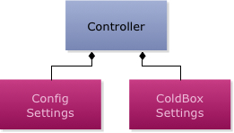

# Using Settings



The ColdBox Controller \(stored in ColdFusion `application` scope as `application.cbController`\) stores all your **application** settings and also your **system** settings:

* **`ColdboxSettings`** : Framework specific system settings
* **`ConfigSettings`** : Your application settings

You can use the following methods to retrieve/set/validate settings in your handlers/layouts/views and interceptors:


```javascript
/**
 * Get a setting from the system
 *
 * @name The key of the setting
 * @defaultValue If not found in config, default return value
 *
 * @throws SettingNotFoundException
 *
 * @return The requested setting
 */
function getSetting( required name, defaultValue )

/**
 * Get a ColdBox setting
 *
 * @name The key to get
 * @defaultValue The default value if it doesn't exist
 *
 * @throws SettingNotFoundException
 *
 * @return The framework setting value
 */
function getColdBoxSetting( required name, defaultValue )

/**
 * Check if the setting exists in the application
 *
 * @name The key of the setting
 */
boolean function settingExists( required name )

/**
 * Set a new setting in the system
 *
 * @name The key of the setting
 * @value The value of the setting
 *
 * @return FrameworkSuperType
 */
any function setSetting( required name, required value )

/**
 * Get a module's settings structure or a specific setting if the setting key is passed
 *
 * @module The module to retrieve the configuration settings from
 * @setting The setting to retrieve if passed
 * @defaultValue The default value to return if setting does not exist
 *
 * @return struct or any
 */
any function getModuleSettings( required module, setting, defaultValue )
```


You can also get access to these methods in handlers via the ColdBox Controller component:

```javascript
controller.getSetting()
controller.getColdBoxSetting()
controller.setSetting()
controller.settingExists()
controller.getConfigSettings()
controller.getColdBoxSettings()
```

or using the application scope from modules and other locations where `controller` isn't injected:

```javascript
application.cbController.getSetting()
application.cbController.setSetting()
application.cbController.settingExists()
application.cbController.getConfigSettings()
application.cbController.getColdBoxSettings()
```

## Injecting Settings

You can use the WireBox injection DSL to inject settings in your models or non-ColdBox objects. Below are the available DSL notations:

* `coldbox:setting:{key}` : Inject a specified config setting key
* `coldbox:coldboxSetting:{key}` : Inject a specified ColdBox setting key
* `coldbox:configSettings` : Inject a reference to the application settings structure
* `coldbox:coldboxSettings` : Inject a reference to the ColdBox System settings structure

```javascript
component{

    property name="mysetting"    inject="coldbox:setting:mysetting";
    property name="path"         inject="coldbox:coldboxSetting:path";
    property name="config"       inject="coldbox:configSettings";
    property name="settings"     inject="coldbox:coldboxSettings";

}
```

