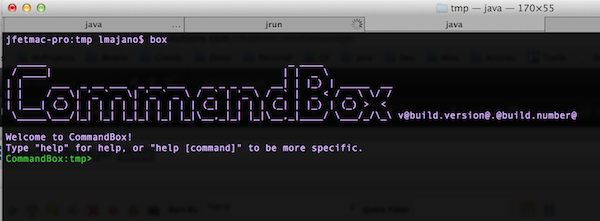

# Installing ColdBox

**Welcome to the world of ColdBox! **

We are excited you are taking this development journey with us. Before we get started with ColdBox let's install CommandBox CLI, which will allow you to install/uninstall dependencies, start servers, have a REPL tool and much more.

## IDE Tools

ColdBox has the following supported IDE Tools:

* Sublime - [https://packagecontrol.io/packages/ColdBox Platform](https://packagecontrol.io/packages/ColdBox%20Platform)
* VSCode - [https://marketplace.visualstudio.com/items?itemName=ortus-solutions.vscode-coldbox](https://marketplace.visualstudio.com/items?itemName=ortus-solutions.vscode-coldbox)
* CFBuilder - [https://www.forgebox.io/view/ColdBox-Platform-Utilities](https://www.forgebox.io/view/ColdBox-Platform-Utilities)

## CommandBox CLI


The first step in our journey is to [install](https://commandbox.ortusbooks.com/content/setup/installation.html) CommandBox. [CommandBox](https://www.ortussolutions.com/products/commandbox) is a ColdFusion \(CFML\) Command Line Interface \(CLI\), REPL, Package Manager and Embedded Server. We will be using CommandBox for almost every excercise in this book and it will also allow you to get up and running with ColdFusion and ColdBox in a much speedier manner.

> **Note** : However, you can use your own ColdFusion server setup as you see fit. We use CommandBox as everything is scriptable and fast!

### Download CommandBox

You can download CommandBox from the official site: [https://www.ortussolutions.com/products/commandbox\#download](https://www.ortussolutions.com/products/commandbox#download) and install in your preferred Operating System \(Windows, Mac, \*unix\). CommandBox comes in two flavors:

1. No Java Runtime \(30mb\)
2. Embedded Runtime \(80mb\)

So make sure you choose your desired installation path and follow the instructions here: [https://commandbox.ortusbooks.com/content/setup/installation.html](https://commandbox.ortusbooks.com/content/setup/installation.html)

### Starting CommandBox

Once you download and expand CommandBox you will have the `box.exe` or `box` binary, which you can place in your Windows Path or \*Unix `/usr/bin` folder to have it available system wide. Then just open the binary and CommandBox will unpack itself your user's directory: `{User}/.CommandBox`. This happens only once and the next thing you know, you are in the CommandBox interactive shell!



We will be able to execute a-la-carte commands from our command line or go into the interactive shell for multiple commands. We recommend the interactive shell as it is faster and can remain open in your project root.


 All examples in this book are based on the fact of having an interactive shell open.


## Installing ColdBox

To get started open the CommandBox binary or enter the shell by typing `box` in your terminal or console. Then let's create a new folder and install ColdBox into a directory.

```bash
mkdir myapp --cd
install coldbox
```

CommandBox will resolve `coldbox` from ForgeBox \([www.forgebox.io](https://www.forgebox.io)\), use the **latest version** available, download and install it in this folder alongside a `box.json` file which represents your application package.

```text
Dir 0 Apr 25,2018 11:04:05 coldbox
File 112 Apr 25,2018 11:04:05 box.json
```


You can also install the latest bleeding edge version by using the `coldbox@be` slug instead, or any previous version.


That's it. CommandBox can now track this version of ColdBox for you in this directory. In the [next section](my-first-coldbox-application.md) we will scaffold a ColdBox application using an application template.


You can find many scaffolding templates for ColdBox in our Github organization: [github.com/coldbox-templates](https://github.com/coldbox-templates)


## Uninstalling ColdBox

To uninstall ColdBox from this application folder just type `uninstall coldbox`.

## Updating ColdBox

To update ColdBox from a previous version, just type `update coldbox`.

