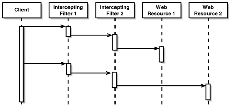

# Interceptors

Interceptors are CFC listeners that react on incoming events.  Events can be announced by the core framework or your application.  These interceptors can also be stacked to form interceptor chains that can be executed implicitly for you. These stacked interceptor chains form a chain of separate, declarative-deployable services to an existing web application without incurring any changes to the main application or framework source code. This is a powerful feature that can help developers and framework contributors share and interact with their work. (Read more on [Intercepting Filters](http://www.corej2eepatterns.com/Patterns2ndEd/InterceptingFilter.htm))




## Event Driven Programming
The way that interceptors are used is usually referred to as event-driven programming, which can be very similiar if you are already doing any JavaScript or AngularJS coding.  You can listen and execute intercepting points anywhere you like in your application, you can even produce content whenever you announce:

```html
<!--- Announce an event in the div and produce content --->
<div>#announceInterception( 'onSidebar' )#</div>
```

However, we went a step further with ColdBox interceptors and created the hooks necessary in order to implement an event-driven programming pattern into the entire interceptor service. Ok ok, what does this mean? It means, that you are not restricted to the pre-defined interception points that ColdBox provides, you can create your own WOW! Really? Yes, you can very easily declare execution points via the configuration file or register at runtime, create your interceptors with the execution point you declared (Conventions baby!!) and then just announce interceptions in your code via the interception API.


If you are familiar with design patterns, custom interceptors can give you an implementation of observer/observable objects, much like any event-driven system can provide you. If you are not familiar with event-driven systems or what an observer is, please read the following resources. In a nutshell, an observer is an object that is registered to listen for certain types of events, let's say as an example onError is a custom interception point and we create a CFC that has this onError method. Whenever in your application you announce or broadcast that an event of type onError occurred, this CFC will be called by the ColdBox interceptor service.

wik
