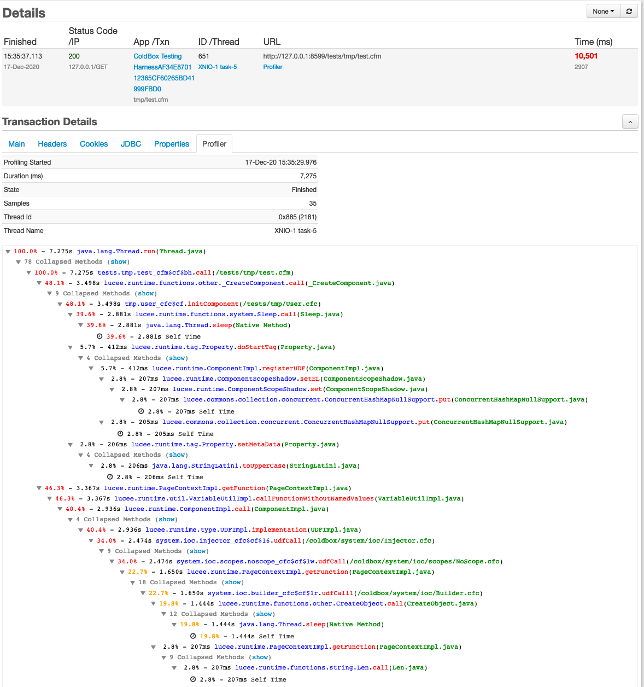
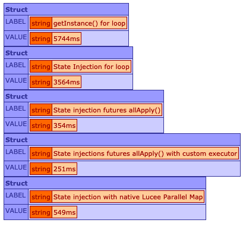
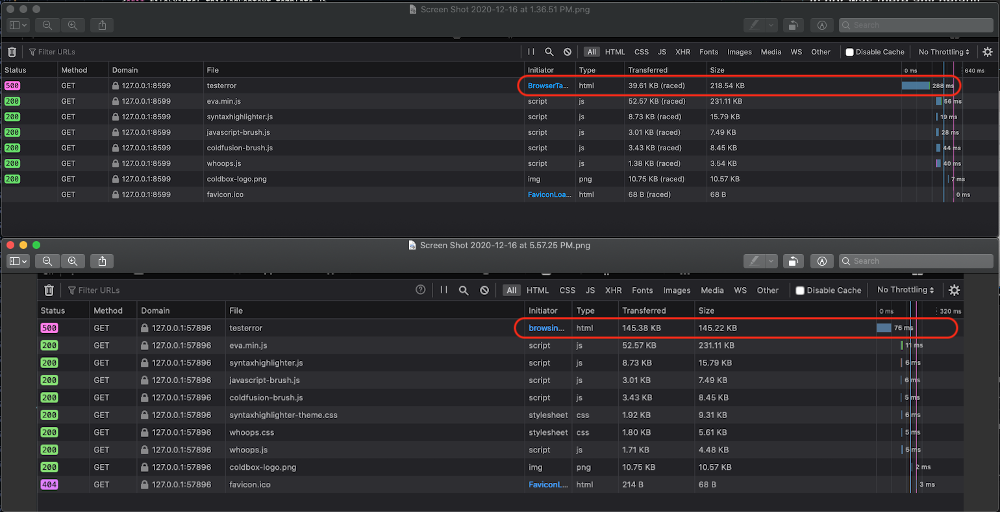

# What's New With 6.2.0

ColdBox 6.2.0 is a minor release with some major improvements in many areas like:

* Async programming
* Logging
* Object creations
* WireBox Mappings and Binders

### WireBox Binder & Mapping Objects Rewritten

This is a **major** change in the core as we have finally rewritten the WireBox `Binder` and object `Mapping` objects to script.  This resulted in a 45-50% code reduction for those objects and an impressive 30% speed improvements when creating and processing mappings with the new binder processing optimizations.  We analyzed every single line of code on these two objects and we are incredibly satisfied with the initial results.

That's right, we have some async goodness prepared for future versions when dealing with multiple directory mappings and much more.

### Async Package Performance Upgrades



We have done more runtime analysis on our `asynchronous` package and we have optimized the heck out of it using the amazing [FusionReactor](https://www.fusion-reactor.com/) Profilers!  Especially the `applyAll()` and collection based parallel computing.  We reached a point where all of our tests cases where running faster than even native Lucee/Adobe 2021 parallel constructs.  Below you can see a snapshot of our test bed creating 1000 transient objects with dependency injections and object populations using async constructs.



You can find our test bed here: [https://github.com/ColdBox/coldbox-platform/blob/development/tests/suites/async/performance-parallel-tests.cfm](https://github.com/ColdBox/coldbox-platform/blob/development/tests/suites/async/performance-parallel-tests.cfm)

Just a reminder that the ColdBox async capabilities are all powered by the Java concurrency packages leveraging [Completable Futures](https://docs.oracle.com/en/java/javase/11/docs/api/java.base/java/util/concurrent/CompletableFuture.html), [Executors](https://docs.oracle.com/en/java/javase/11/docs/api/java.base/java/util/concurrent/Executors.html) and [Scheduled Tasks](https://docs.oracle.com/en/java/javase/11/docs/api/java.base/java/util/concurrent/ScheduledExecutorService.html).  It is not only true to the Java API but we have made tons of enhancements especially for ColdFusion and its dynamic nature.  [Check out our docs](../../digging-deeper/promises-async-programming/)!  

**It is also available to ANY ColdFusion application that is NOT running ColdBox. This is achieved by using either of our standalone libraries: WireBox, CacheBox and LogBox.**

### Test Dependency Injection

This version introduces the capability for you to tag your integration tests with an `autowire` annotation on the component tag. By adding this annotation, your test object will be inspected and wired with dependencies just like any other WireBox object.

```javascript
component extends="coldbox.system.testing.BaseTestCase" autowire {
	
	// DI
	property name="securityService" inject="provider:securityService";
	property name="jwt"             inject="provider:JWTService@cbsecurity";
	property name="cbsecure"        inject="provider:CBSecurity@cbsecurity";
	property name="qb"              inject="provider:QueryBuilder@qb";

	/*********************************** BDD SUITES ***********************************/
	function run(){
		describe( "Authentication Specs", function(){
			beforeEach( function( currentSpec ){
				// Setup as a new ColdBox request for this suite, VERY IMPORTANT. ELSE EVERYTHING LOOKS LIKE THE SAME REQUEST.
				setup();
				// Make sure nothing is logged in to start our calls
				securityService.logout();
				jwt.getTokenStorage().clearAll();
			} );

			story( "I want to authenticate a user via username/password and receive a JWT token", function(){
				given( "a valid username and password", function(){
					then( "I will be authenticated and will receive the JWT token", function(){
						// Use a user in the seeded db
						var event = this.post(
							"/api/v1/login",
							{
								username : variables.testEmployeeEmail,
								password : variables.testPassword
							}
						);
						var response = event.getPrivateValue( "Response" );
						expect( response.getError() ).toBeFalse( response.getMessagesString() );
						expect( response.getData() ).toHaveKey( "token,user" );
						// debug( response.getData() );
						var decoded = jwt.decode( response.getData().token );
						expect( decoded.sub ).toBe( variables.testEmployeeId );
						expect( decoded.exp ).toBeGTE( dateAdd( "h", 1, decoded.iat ) );
						expect( response.getData().user.userId ).toBe( variables.testEmployeeId );
					} );
				} );
				given( "invalid username and password", function(){
					then( "I will receive a 401 invalid credentials exception ", function(){
						var event = this.post(
							"/api/v1/login",
							{ username : "invalid", password : "invalid" }
						);
						var response = event.getPrivateValue( "Response" );
						expect( response.getError() ).toBeTrue();
						expect( response.getStatusCode() ).toBe( 401 );
					} );
				} );
			} );

		} );
	}

}
```

### ColdBox Test Matchers

We have also included a new object `coldbox.system.testing.CustomMatchers` which will register matchers into TestBox when doing integration tests.  It will give you the nice ability to expect status codes and validation exceptions on RESTFul Requests via the ColdBox Response object.

* `toHaveStatus()`
* `toHaveInvalidData()`

```javascript
var event = this.post(
    "/api/v1/login",
    { username : "invalid", password : "invalid" }
);
var response = event.getPrivateValue( "Response" );
expect( response.getError() ).toBeTrue();
expect( response.getStatusCode() ).toBe( 401 );

var event = this.post(
    "api/v1/timelogs",
    { description : "A nice unit test" }
);
expect( event.getResponse() ).toHaveStatus( 400 );
expect( event.getResponse() ).toHaveInvalidData( "project", "is required" )
expect( event.getResponse() ).toHaveInvalidData( "task", "is required" )
expect( event.getResponse() ).toHaveInvalidData( "user", "is required" )
```

### More Rendering Improvements

Thanks to Dom Watson \([@dom\_watson](https://twitter.com/dom_watson)\) from PresideCMS \([@presidecms](https://twitter.com/presidecms)\) for many contributions to help clean up ColdBox view rendering! This release focuses on more performance and memory utilization updates, as well as refactoring external dependencies from pre singleton rendering approaches, which has resulted in more performance gains and lower memory usages on high rendering apps. 

### Whoops! Keeps Getting Better

We have had tons of updates and requests from our new exception handling experience in ColdBox: Whoops!  In this release we tackle CFML core engine files so they can render appropriately, AJAX rendering for exceptions and best of all a huge performance and size boost when dealing with exceptions.  Even when dealing with exceptions we want the best and the fastest experience possible for our developers.

The previous approach whoops took was to read and load all the source code of all the templates that caused the exception. You could then navigate them to discover your faults. However, each template could be loaded from 1 to up to 10 times if the stack trace followed it.  In this new update we provide source template caching and dynamic runtime injection and highlighting of the source code.  This has granted us the following improvements in small test cases \(Your improvements could be higher\)

Original Size: 218.54 KB  
New Size: 145.22 KB   
**About 30-40% reduction on size depending on repetition of the templates**

Original Rendering Speed: 288ms  
New Rendering Speed: 76ms   
**About 74-80% rendering improvements** 



## Release Notes



### Bugs

* \[[COLDBOX-936](https://ortussolutions.atlassian.net/browse/COLDBOX-936)\] - `ExceptionBean` throws exception on weird ORM illegal access collection on scope dump
* \[[COLDBOX-937](https://ortussolutions.atlassian.net/browse/COLDBOX-937)\] - Migration to `cgi.server_name` and `server_port` did not account for the incoming browser port but the cf service port
* \[[COLDBOX-938](https://ortussolutions.atlassian.net/browse/COLDBOX-938)\] - `getFullURL()` is not accounting for app mappings
* \[[COLDBOX-939](https://ortussolutions.atlassian.net/browse/COLDBOX-939)\] - Invalid event handler detection was overriding some event handler beans
* \[[COLDBOX-941](https://ortussolutions.atlassian.net/browse/COLDBOX-941)\] - `timeUnits` had type mismatches when used in async futures' `allApply`
* \[[COLDBOX-948](https://ortussolutions.atlassian.net/browse/COLDBOX-948)\] - Whoops should validate a file exists before trying to present it to the code viewer

### New Features

* \[[COLDBOX-942](https://ortussolutions.atlassian.net/browse/COLDBOX-942)\] - Add `timeout` and `timeUnit` arguments to the `allApply()` method directly when using Futures
* \[[COLDBOX-943](https://ortussolutions.atlassian.net/browse/COLDBOX-943)\] - New global settings: `sesBasePath` and `HtmlBasePath` that represent the pathing with no host and protocol
* \[[COLDBOX-946](https://ortussolutions.atlassian.net/browse/COLDBOX-946)\] - new request context method `getFullPath()` which returns the full url with no protocol or host
* \[[COLDBOX-957](https://ortussolutions.atlassian.net/browse/COLDBOX-957)\] - New `autowire` annotation or \``variables.autowire`\` on integration tests so ColdBox will autowire the test with dependencies via WireBox
* \[[COLDBOX-958](https://ortussolutions.atlassian.net/browse/COLDBOX-958)\] - Store the test case metadata on \```variables.metadata``` so it can be reused by any helper within test operations
* \[[COLDBOX-959](https://ortussolutions.atlassian.net/browse/COLDBOX-959)\] - New ColdBox `CustomMatchers` object found at `coldbox.system.testing.CustomMatchers` which is loaded on all tests

### Improvements

* \[[COLDBOX-895](https://ortussolutions.atlassian.net/browse/COLDBOX-895)\] - migrating usage of `cgi.http_host` to cgi.`server_name` due to inconsistencies with proxy requests that affects caching and many other features
* \[[COLDBOX-931](https://ortussolutions.atlassian.net/browse/COLDBOX-931)\] - `ProcessStackTrace()` Creates Many Nested Spans, improved output HTML
* \[[COLDBOX-933](https://ortussolutions.atlassian.net/browse/COLDBOX-933)\] - Improved safety reset for base test cases
* \[[COLDBOX-940](https://ortussolutions.atlassian.net/browse/COLDBOX-940)\] - Performance optimizations for entire **async** package
* \[[COLDBOX-944](https://ortussolutions.atlassian.net/browse/COLDBOX-944)\] - Refactored cgi server and port detections to improve testability and single responsibiilty principles
* \[[COLDBOX-945](https://ortussolutions.atlassian.net/browse/COLDBOX-945)\] - Event caching now bases off the multi host key from the `event.getSESBaseURL()` to improve consistencies and single responsibility
* \[[COLDBOX-947](https://ortussolutions.atlassian.net/browse/COLDBOX-947)\] - encapsulate `processEception()` from the bootstrap to within the exception objects
* \[[COLDBOX-949](https://ortussolutions.atlassian.net/browse/COLDBOX-949)\] - better exception tracking for interceptor `getProperty()` calls that don't exist
* \[[COLDBOX-952](https://ortussolutions.atlassian.net/browse/COLDBOX-952)\] - `RendererEncapsulator`: use of filter method for `rendererVariables` is inefficient, migrated to less fluent but more performant approach.
* \[[COLDBOX-953](https://ortussolutions.atlassian.net/browse/COLDBOX-953)\] - Update `DateFormat` Mask to use lowercase "d" to be compatible with ACF2021
* \[[COLDBOX-954](https://ortussolutions.atlassian.net/browse/COLDBOX-954)\] - Refactor `viewsHelperRef` and `layoutsHelperRef` to local renderer variables instead of settings, which resulted in even better speed improvements
* \[[COLDBOX-955](https://ortussolutions.atlassian.net/browse/COLDBOX-955)\] - If in an Ajax request and an exception occurs using Whoops the view is unusable
* \[[COLDBOX-956](https://ortussolutions.atlassian.net/browse/COLDBOX-956)\] - Whoops loads multiple files into the DOM for the templates in the stacktrace causing major slowdownsa



### Improvements

* \[[COLDBOX-945](https://ortussolutions.atlassian.net/browse/COLDBOX-945)\] - Event caching now bases off the multi host key from the event.getSESBaseURL\(\) to improve consistencies and single responsibility
* \[[COLDBOX-953](https://ortussolutions.atlassian.net/browse/COLDBOX-953)\] - Update `DateFormat` Mask to use lowercase "d" to be compatible with ACF2021



### Bugs

* \[[LOGBOX-56](https://ortussolutions.atlassian.net/browse/LOGBOX-56)\] - Missing line break on file appender control string

### New Features

* \[[LOGBOX-57](https://ortussolutions.atlassian.net/browse/LOGBOX-57)\] - new `shutdown()` method to process graceful shutdown of LogBox
* \[[LOGBOX-58](https://ortussolutions.atlassian.net/browse/LOGBOX-58)\] - New logbox config `onShutdown()` callback, which is called when LogBox has been shutdown
* \[[LOGBOX-59](https://ortussolutions.atlassian.net/browse/LOGBOX-59)\] - New `shutdown()` method can be now used in appenders that will be called when LogBox is shutdown



### Bugs

* \[[WIREBOX-99](https://ortussolutions.atlassian.net/browse/WIREBOX-99)\] - parameter \[binder\] to function \[process\] is required but was not passed in When setting coldbox.autoMap to false and choosing either method of mapping a directory:
* \[[WIREBOX-102](https://ortussolutions.atlassian.net/browse/WIREBOX-102)\] - ACF incompats with future combinations due to dumb elvis operator bug

### New Features

* \[[WIREBOX-98](https://ortussolutions.atlassian.net/browse/WIREBOX-98)\] - Pass the current `injector` to the binder's life-cycle methods: `onShutdown(), onLoad()`
* \[[WIREBOX-100](https://ortussolutions.atlassian.net/browse/WIREBOX-100)\] - Create a `processEagerInits()` so it can process them at wirebox load
* \[[WIREBOX-101](https://ortussolutions.atlassian.net/browse/WIREBOX-101)\] - Complete rewrite of the `Mapping` object to script and performance optimizations
* \[[WIREBOX-103](https://ortussolutions.atlassian.net/browse/WIREBOX-103)\] - Complete rewrite of the WireBox `Binder` to script and optimizations
* \[[WIREBOX-104](https://ortussolutions.atlassian.net/browse/WIREBOX-104)\] - New WireBox config: `autoProcessMappings` which can be used to auto process metadata inspections on startup.




