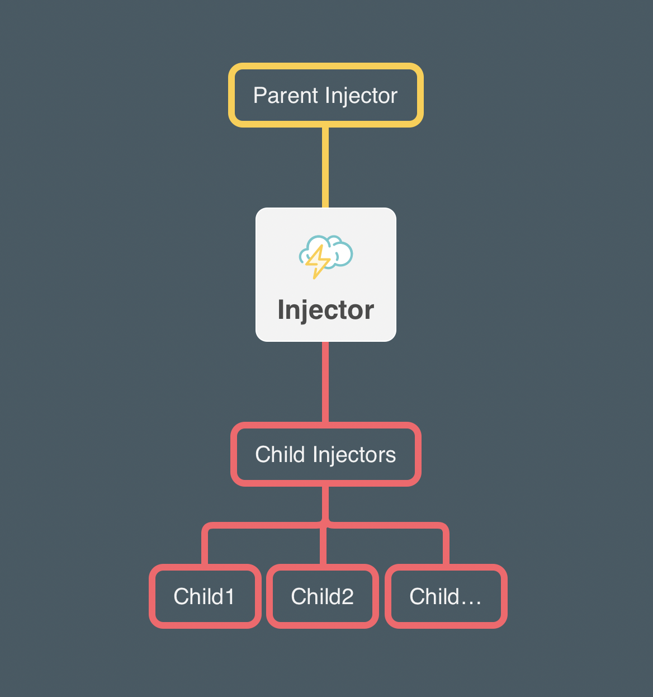

# What's New With 6.6.0

## Major Updates

### WireBox Child Injectors



Welcome to the world of hierarchical dependency injection.  We had the ability before to add a parent injector to WireBox, but now you can not only add a parent, but also many children to the hierarchy.

Every injector has the capability to store an ordered collection \(`ordered struct`\) of child injectors via the `childInjectors` property. Child injectors are used internally in many instances to provide a hierarchical approach to DI where instances can be searched for locally, in the parent and in the children. Here are some of the new methods to assist with child injectors:

* `hasChildInjector( name )` - Verify if a child injector has been registered
* `registerChildInjector( name, child )` - Register a child injector by name
* `removeChildInjector( name )` - Remove a child injector by name
* `getChildInjector( name )` - Get a child injector by name
* `getChildInjectors()` - Get all the child injectors registered
* `getChildInjectorNames()` - Get an array of all the registered child injectors

#### Child Enhanced Methods

* `getInstance()`
  * The `getInstance()`method now has an `injector` argument so you can **EXPLICITLY** request an instance from a child injector by name `getInstance( name : "service", injector : "childInjector" )`
  * Apart from the explicit lookup it can also do implicit hierarchical lookups using the following order:
    * Locally
    * Parent
    * All Children \(in order of registration\)
* `containsInstance( name )` - This method now also searches in the child collection for the specific `name` instance. The lookup searches in the following order:
  1. Locally
  2. Parent
  3. Children
* `shutdown()` - The shutdown method has been enhanced to issue shutdown method calls to all child injectors registered.

### Getting Instances From Specific Child Injectors

The `getInstance()` has been modified to have an `injector` argument that you can use to specifically ask for an instance from that child injector. If the child injector has not been registered you will get a `InvalidChildInjector` Exception.

```javascript
getInstance( name: "CategoryService", injector : "ChildInjector" )
```

### Child Injector Explicit DSL

The following is the DSL you can use to **explicitly** target a child injector for a dependency. You will prefix it with `wirebox:child:{name}` and the name of the injector:

```javascript
// Use the property name as the instance name
property name="categoryService" inject="wirebox:child:childInjector"
// Use a specific instance name
property name="categoryService" inject="wirebox:child:childInjector:CategoryService"
// Use any DSL
property name="categoryService" inject="wirebox:child:childInjector:{DSL}"
```

### IInjector Interface Updates

The `coldbox.system.ioc.IInjector` interface's `getInstance()` method has been modified to include support for child injector retrievals:

```javascript
/**
 * Locates, Creates, Injects and Configures an object model instance
 *
 * @name The mapping name or CFC instance path to try to build up
 * @initArguments The constructor structure of arguments to passthrough when initializing the instance
 * @dsl The dsl string to use to retrieve the instance model object, mutually exclusive with 'name'
 * @targetObject The object requesting the dependency, usually only used by DSL lookups
 * @injector The child injector name to use when retrieving the instance
 */
function getInstance(
	name,
	struct initArguments,
	dsl,
	targetObject = "",
	injector
);
```

