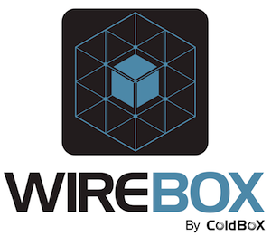

# Models

ColdBox allows you to integrate with the model layer with easy by leveraging **WireBox** as your default dependency injection framework.  However, you can integrate your model layer with any third-party DI framework via our `cbioc` module (https://github.com/ColdBox/cbox-ioc).

WireBox, is our dependency injection and AOP framework, that will do all the magic of building, wiring objects with dependencies and helping your persist objects in some state (singletons, transients, request, etc). The main purpose for model integration is to make developer's development workflow easier! And we all like that Easy button! 

## Benefits 

* Easily create and retrieve model objects by using one method: `getModel()`
* Easily handle model or handler dependencies by using `cfproperty` and constructor argument conventions.
* A conventions DSL (Domain Specific Language) has been created to facilitate what needs to be injected in the models
* Easily determine what scope model objects should be persisted in: Transients, Singletons, Cache, Request, Session, etc.
* Easily create a configuration binder to create aliases or complex object relationships (Java, WebServices, RSS, etc.)
* Easily populate model objects or even ORM entity objects with data from a request: populateModel()
* Easily compose ORM relationships from request data using populateModel()
* Easily [validate](http://wiki.coldbox.org/wiki/Validation.cfm) model objects using our awesome [ValidBox](http://wiki.coldbox.org/wiki/Validation.cfm) validation engine and validateModel()
* Integrate with ColdFusion ORM via our [ActiveEntity](http://wiki.coldbox.org/wiki/ORM:ActiveEntity.cfm) class if you like Active Record pattern or
* Integrate with ColdFusion ORM via our [ORM Service](http://wiki.coldbox.org/wiki/ORM:BaseORMService.cfm) or [Virtual Entity Services](http://wiki.coldbox.org/wiki/ORM:VirtualEntityService.cfm).

Wow! You can do all that? Yes and much more. So let's begin.
