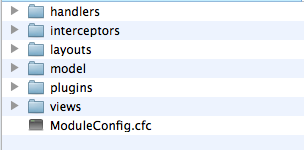

# Module Layout

So in order to create a module, you must first create a nicely named directory within the modules conventions directory. For example, let's build a simple *hello world* module, CommandBox to the rescue.

```bash
coldbox create module helloworld
```

Here is the output:

```
Created /Users/lmajano/tmp/myapp/modules/helloworld
Created /Users/lmajano/tmp/myapp/modules/helloworld/handlers
Created /Users/lmajano/tmp/myapp/modules/helloworld/handlers/Home.cfc
Created /Users/lmajano/tmp/myapp/modules/helloworld/models
Created /Users/lmajano/tmp/myapp/modules/helloworld/models/models_here.txt
Created /Users/lmajano/tmp/myapp/modules/helloworld/ModuleConfig.cfc
Created /Users/lmajano/tmp/myapp/modules/helloworld/views
Created /Users/lmajano/tmp/myapp/modules/helloworld/views/home
Created /Users/lmajano/tmp/myapp/modules/helloworld/views/home/index.cfm
```

The layout of a ColdBox Module can be almost all of it be optional except for one file: `ModuleConfig.cfc`. This is a simple CFC that boots up your module and tells the host application how your module is loaded, unloaded and behaves. If you are leveraging CommandBox then you can also declare a `box.json` for the module itself in order to declare dependencies and development dependencies for it.

Below are all the possible combinations of a module layout, you will notice that it is EXACTLY the same as a ColdBox application.

```js
+Modules
  + {ModuleName - Unique}
    + ModuleConfig.cfc (The module configuration object Mandatory)
    + box.json (optional - if using CommandBox)
    + handlers (optional)
    + layouts  (optional)
    + views    (optional)
    + plugins  (optional)
    + interceptors (optional)
    + model    (optional)
```

As you can see, the only mandatory resources for a module is the directory name in which it lives and a `ModuleConfig.cfc`. The module developer can choose to implement a simple module or a very complex module. All folders are optional and only what is used will be loaded. Not only are modules reusable and extensible, but you can easily create a module with dual functionality: A standalone application or a module. This is true reusability and flexibility. I don't know about you, but this is really exciting (Geek Alert!).

