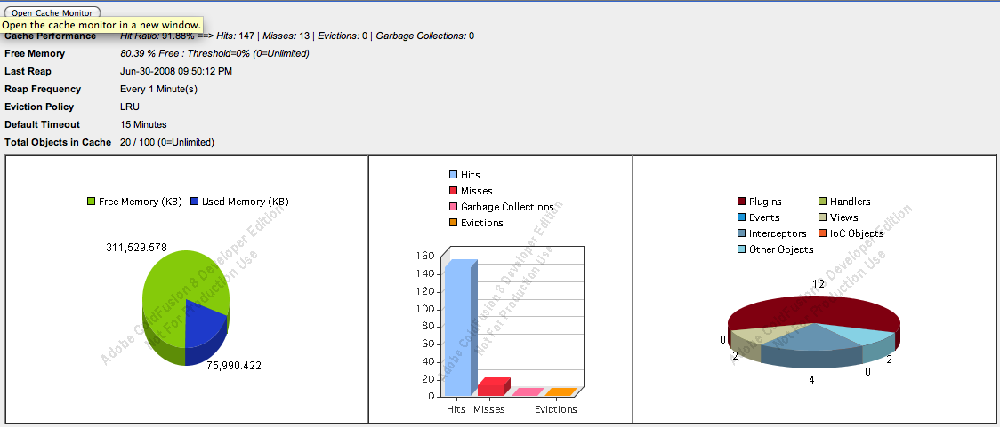

# Caching objects

The sample you will see below consists of three parts:

1. Setup of an object in cache
2. Testing of the object in cache
3. Retrieving the object in cache.

Remember that the ColdBox Object Cache Manager is available to you from any execution point. You only need to use the following snippet to have access to it:

```js
getColdboxOCM();
```

or

```js
getController().getColdboxOCM();
```

As for all the functionality of this wonderful caching system, please look at the [[ColdboxCache | ColdBox Cache] and at the latest [CFC Api](http://www.coldbox.org/api).

> **Important** The ColdBox cache is a java/coldfusion hybrid and therefore it is CASE SENSITIVE!

### Step 1: Step of an object in cache

The actual first setup of an object can occur in any point in time, but for this example I will do it in the onAppInit method of my application, which has been declared in my **coldbox.xml.cfm**. This method executes on every application start.


```js
<cffunction name="onAppInit" access="public" returntype="void" output="false">
  <cfargument name="Event" type="coldbox.system.beans.requestContext">
  <cfset var MyServicePath = "mycomponents.generator.GeneratorService">
  <cfset var GService = CreateObject("component",MyService).init(getSetting("adminpass"))>

  <---  Place object in object cache and persist it with a default Framework Timeout. --->
  <cfset getColdboxOCM().set("GService",GService)>
</cffunction>
```

You can set objects in the cache with the following method:

```js
set(any objectKey, any MyObject, [any Timeout], [any LastAccessTimeout])
```

|Argument|Description|
|--|--|
|objectKey|The key alias to use|
|MyObject|The object to cache |
|Timeout |The object timeout |
|LastAccessTimeout |The last access timeout to use |

So what I do is set the MyService variable to the location of my Generator Service component first. Then I create the generator component and set it to the local variable GService. I then proceed to execute a set on the Object Cache Manager with the key and the object. I could have also provided a timeout for the object, but in this case, I want ColdBox to manage it for me. When you start your application and you look at the debugging panel. You will see the following snapshot:



From here you can tell that there is an Other Object in the cache, which will be the Generator Service.

### Step 2: Testing if the object is in cache
Another important aspect of the ColdBox cache is that it will do garbage collection on them, so in order for me to use them, I have to verify that the objects are in memory. This is where the lookup kicks in. Look at the following code that I have place on my onRequestStart method. This means that the application tests on every request if the generator service is still in the cache and if its not, then it places it again. You could do this in a thousand different ways, but for purposes of example, this is the way I choose to do it.

```js
<cffunction name="onRequestStart" access="public" returntype="void" output="false">
  <cfargument name="Event" type="coldbox.system.beans.requestContext">
  <---  Check if the GService is set, else set it in cache --->
  <cfif not getColdboxOCM().lookup("GService")>
    <cfset onAppInit(Event)>
  </cfif>
</cffunction>
```

You can see that I first do a lookup of the GService key and it is not found, then I execute my AppInit method. Interesting note here, what do I do if the setup is in another handler and not the same one. Well, very easily I would call the event via the RunEvent("ehMyHandler.onAppInit") method. I do not pass the request context, because the framework takes care of it. This is a side note, but a very important one.

### Step 3: Retrieving the object from cache

Now that I execute a normal event, I am assured that the generator service will still be in the cache. So I can go ahead and retrieve it with confidence:

```js
<cffunction name="getDSNs" access="private" returntype="struct" output="false">
  <cfreturn getColdboxOCM().get("GService").getModel("adminAPIService").getdatasources() />
</cffunction>

//Another method below:
<cffunction name="doGenerate" access="public" returntype="void" output="false">
  <cfargument name="Event" type="coldbox.system.beans.requestContext">
  <cfset var rc = Event.getCollection()>
  <cfset var gService = getColdboxOCM().get("GService")>

  <---  EXIT HANDLERS: --->
  <cfset rc.xehGenerate = "ehGeneral.doGenerate">

  <---  Get Setup --->
  <cfset rc.DSNs = getDSNs() />
  <cfset rc.dbType = getDBType()>
  <cfset rc.tables = getTables()>

  <---  Get Table XML --->
  <cfset gService.getModel(rc.dbType).setTable(Event.getValue("table")) />
  <cfset gService.getModel(rc.dbType).setComponentPath(Event.getValue("componentPath")) />
  <cfset rc.xmlTable = gService.getModel(rc.dbType).getTableXML() />

  <---  Get Generated CFC's --->
  <cfset gService.getModel("xsl").configure(Event.getValue("dsn"),getSetting("xslBasePath")) />
  <---  get an array containing the generated code --->
  <cfset rc.arrComponents = gService.getModel("xsl").getComponents(rc.xmlTable) />

  <---  Set the View --->
  <cfset Event.setView("vwGeneration")>
</cffunction>
```

As you can see from the samples above, I present two method examples. By using the getColdboxOCM().get("Key") method, I retrieve an object. Now what happens if the object is not there anymore? Then you will get the value in the public property getColdboxOCM().NOT_FOUND. This is very important.

> **Infor** If an object is not found calling the get() method, you will get the value defined in the public property of the cache manager called: NOT_FOUND. To get this variable use getColdboxOCM().NOT_FOUND

Well, I believe this pretty much covers how you can use the ColdBox Object Cache Manager to persist your objects and data in an intelligent and garbage collected fashion. Have fun and enjoy.
