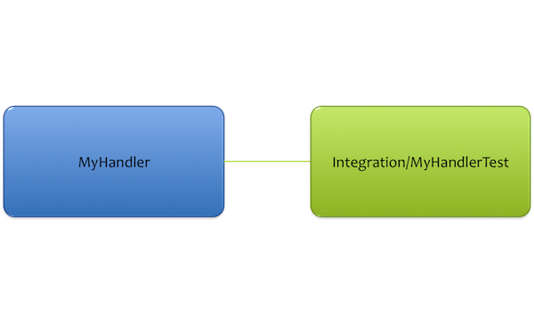

# Integration Testing

We will begin our adventure with integration testing. Integration testing allows you to test a real life request to your application without using a browser. Your test will load a new virtual application for you for each test; all aspects of your application are loaded: caching, dependency injection, AOP, etc. Then you can target an event to test and verify its behavior accordingly. First of all, these type of tests go in your integration folder of your test harness or in the specific module folder if you are testing modules.

Here are the basics to follow for integration testing:

* Create one test CFC for each event handler you would like to test
* Test CFC inherits from coldbox.system.testing.BaseTestCase
* The test CFC can have some annotations that tell the testing framework to what ColdBox application to connect to and test
* For each action in your event handler, create a `test{action}` method
* Execution of the event is done via the `execute()` method, which returns a request context object
* Most verifications and assertions are done via the contents of the request context object (request collections)
