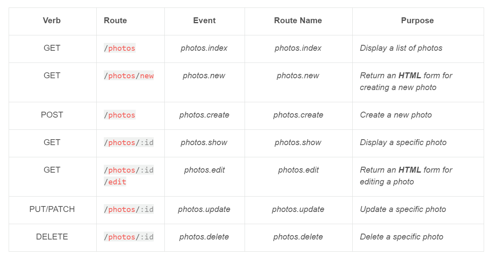

# Resourceful Routes

In ColdBox, you can register resourceful routes to provide automatic mappings between HTTP verbs and URLs to event handlers and actions by convention. By convention, all resources map to a handler with the same name or they can be customized if needed. This allows for a standardized convention when building routed applications.

You can leverage the `resources()` method in your router to register resourceful routes.

```java
// Creates all resources that point to a photos event handler by convention
resources( "photos" );

// Register multiple resources either as strings or arrays
resources( "photos,users,contacts" )
resources( [ "photos" , "users", "contacts" ] );

// Register multiple fluently
resources( "photos" )
    .resources( "users" )
    .resources( "contacts" );

// Creates all resources to the event handler of choice instead of convention
resources( route="photos", handler="MyPhotoHandler" );

// All resources in a module
resources( route="photos", handler="photos", module="api" );

// Resources in a ModuleConfig.cfc
router.resources( "photos" )
  .resources( resource="users", handler="user" )
```

This single resource declaration will create all the necessary variations of URL patterns and HTTP Verbs to actions to handle the resource.  Please see the table below with all the permutations it will create for you.



For in-depth usage of the `resources()` method, let's investigate the API Signature:

```java
/**
* Create all RESTful routes for a resource. It will provide automagic mappings between HTTP verbs and URLs to event handlers and actions.
* By convention, the name of the resource maps to the name of the event handler.
* Example: `resource = photos` Then we will create the following routes:
* - `/photos` : `GET` -> `photos.index` Display a list of photos
* - `/photos/new` : `GET` -> `photos.new` Returns an HTML form for creating a new photo
* - `/photos` : `POST` -> `photos.create` Create a new photo
* - `/photos/:id` : `GET` -> `photos.show` Display a specific photo
* - `/photos/:id/edit` : `GET` -> `photos.edit` Return an HTML form for editing a photo
* - `/photos/:id` : `PUT/PATCH` -> `photos.update` Update a specific photo
* - `/photos/:id` : `DELETE` -> `photos.delete` Delete a specific photo
* 
* @resource         The name of a single resource or a list of resources or an array of resources
* @handler          The handler for the route. Defaults to the resource name.
* @parameterName    The name of the id/parameter for the resource. Defaults to `id`.
* @only             Limit routes created with only this list or array of actions, e.g. "index,show"
* @except           Exclude routes with an except list or array of actions, e.g. "show"
* @module           If passed, the module these resources will be attached to.
* @namespace        If passed, the namespace these resources will be attached to.
*/
function resources(
  required resource,
  handler=arguments.resource,
  parameterName="id",
  only=[],
  except=[],
  string module="",
  string namespace=""
)
```

### Scaffolding Resources

We have created a scaffolding command in CommandBox to help you register and generate resourceful routes.  Just run the following command in CommandBox to get all the help you will need in generating resources:

```bash
coldbox create resource help
```


